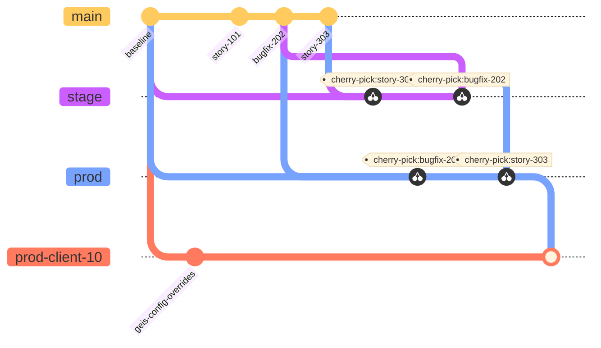
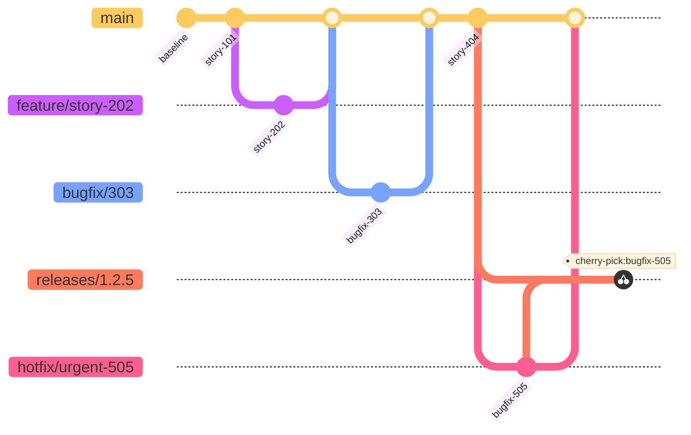

# ADR-002: Monorepo Migration and Branching Workflow

| Field | Value |
| --- | --- |
| **Status** | Proposed |
| **Date** | 1992-04-19 |
| **Decision Makers** | Ton, Jerry |
| **Technical Area** | Development |

## Context

The current development environment is fragmented and complex, leading to significant friction in daily workflows and CI/CD maintenance.

* **Fragmentation:** The codebase has 8 main components spread across 17 repositories.
* **Submodule Sprawl:** Each of these 8 components includes between 3 and 6 submodules. When recursively cloning, this expands to **45 repositories**.
* **Version Skew:** A specific repository (e.g., `common-frontend-submodule`) can be at different versions in different folders/projects.
* **High Friction:** A single story or bugfix often requires changes in 3 or more repositories, necessitating 3 separate merge requests and reviews.
* **Code Duplication:** Searching within the codebase for a definition may reveal the same file in up to 8 locations.
* **AI Tooling Limitations:** AI review tools and agentic code assistants fail to grasp the full context due to repo boundaries and duplicated code. They also struggle with git worktrees.
* **CI/CD Maintenance:** Pipeline definitions are duplicated across 8 repositories, making improvements challenging and requiring coordination.
* **Security:** Dependencies are spread across multiple repositories, making security audits and upgrades difficult.
* **Branching Complexity:**
* Customer-specific customization branches (`prod-client-X`) are required for the 8 main services.
* The `prod` branch is merged onto these customization branches on different schedules based on business needs.
* Stories are cherry-picked (across multiple repositories) from `develop` to `stage` and then to `prod` **out of order** based on business needs.


### Current Submodule Structure

```text
modules/
├─ admin-panel/
│  └─ src/submodules/
│     ├─ common-frontend-submodule/ 🟦
│     ├─ frontend-app-microservice-submodule/ 🟨
│     ├─ frontend-notification-microservice-submodule/ 🟧
│     ├─ frontend-sso-microservice-submodule/ 🟪
│     └─ frontend-worklist-microservice-submodule/ 🟤
├─ application-ms/
│  └─ src/submodules/
│     ├─ common-db-storage-microservice-submodule/ 🟥
│     ├─ common-frontend-submodule/ 🟦
│     ├─ common-microservice-submodule/ 🟩
│     ├─ frontend-app-microservice-submodule/ 🟨
│     ├─ frontend-notification-microservice-submodule/ 🟧
│     └─ main-db-infrastructure-submodule/ 🟫
├─ database-storage-ms/
│  └─ src/submodules/
│     ├─ common-db-storage-microservice-submodule/ 🟥
│     ├─ common-frontend-submodule/ 🟦
│     ├─ common-microservice-submodule/ 🟩
│     ├─ frontend-db-storage-microservice-submodule/
│     ├─ frontend-notification-microservice-submodule/ 🟧
│     └─ main-db-infrastructure-submodule/ 🟫
├─ hl7-to-exam-ms/
│  └─ src/submodules/
│     ├─ common-frontend-submodule/ 🟦
│     ├─ common-microservice-submodule/ 🟩
│     └─ frontend-notification-microservice-submodule/ 🟧
├─ notification-ms/
│  └─ src/submodules/
│     ├─ common-db-storage-microservice-submodule/ 🟥
│     ├─ common-frontend-submodule/ 🟦
│     ├─ common-microservice-submodule/ 🟩
│     ├─ frontend-notification-microservice-submodule/ 🟧
│     └─ main-db-infrastructure-submodule/ 🟫
├─ parsing-ms/
│  └─ src/submodules/
│     ├─ common-frontend-submodule/ 🟦
│     ├─ common-microservice-submodule/ 🟩
│     └─ tenant-db-infrastructure-submodule/
├─ sso-ms/
│  └─ src/submodules/
│     ├─ common-frontend-submodule/ 🟦
│     ├─ common-microservice-submodule/ 🟩
│     ├─ frontend-sso-microservice-submodule/ 🟪
│     └─ main-db-infrastructure-submodule/ 🟫
└─ worklist-ms/
   └─ src/submodules/
      ├─ common-db-storage-microservice-submodule/ 🟥
      ├─ common-frontend-submodule/ 🟦
      ├─ common-microservice-submodule/ 🟩
      ├─ frontend-worklist-microservice-submodule/ 🟤
      └─ main-db-infrastructure-submodule/ 🟫

```

### Current Branching Chaos

The main microservices and frontend have branches for `develop`, `stage`, `pre-prod`, `prod`, and multiple `prod-client-X` branches. Nested submodules lack customer branches but still maintain environment branches.



## Decision

We will migrate to a **Monorepo**, adopt a **Trunk-based workflow** on `main`, create versioned releases, and use ephemeral environments for Merge Requests. We will **replace customer branches** with Parameter Store-backed configuration.

### Monorepo + Trunk-based + AWS Parameter Store + Application State Repo

**Key Details:**

* **Unified Repo:** Create a single monorepo with clear domains: `services/`, `frontends/`, `common/`, and `infra/`.
* **Packages:** Convert current submodules into in-repo packages/workspaces under `common/`.
* **Trunk-Based:** Use `main` as the trunk. Use short-lived `feature/*`, `bugfix/*`, and `hotfix/*` branches.
* **Release Strategy:**
* Release cadence is every two weeks.
* Use `releases/*` branches **only** for stabilization.
* **Strict Cherry-Pick Policy:** Fixes land on `main` first, then are cherry-picked into `releases/*` only as needed for stabilization. Avoid cherry-picking from `releases/*` back to `main` except in emergencies.


* **Configuration:** Replace customer branches with AWS Parameter Store-backed configuration and an Application State Repo.
* **CI/CD:** Standardize CI/CD with shared pipeline templates and per-service jobs.
* **Separation of Concerns:** The application state (environment customization, deployment versions) and CD will be handled in a separate repository. This monorepo will only produce versioned Docker images.

### Proposed Folder Structure

```text
.
├── common
│   ├── common-db-storage-microservice-submodule
│   ├── common-frontend-submodule
│   ├── common-microservice-submodule
│   ├── frontend-app-microservice-submodule
│   ├── frontend-db-storage-microservice-submodule
│   ├── frontend-notification-microservice-submodule
│   ├── frontend-sso-microservice-submodule
│   ├── frontend-worklist-microservice-submodule
│   ├── main-db-infrastructure-submodule
│   └── tenant-db-infrastructure-submodule
├── docker-compose.yaml
├── frontend
│   └── admin-panel
└── service
    ├── app-ms
    ├── db-ms
    ├── hl7-ms
    ├── ns-ms
    ├── ps-ms
    ├── sso-ms
    └── wl-ms

```

### Proposed Workflow



### Pros

* **Consistency:** Eliminates version skew across submodules and removes duplicated code copies.
* **Efficiency:** Reduces change overhead to a single Pull Request for cross-cutting work.
* **Visibility:** Makes code search, audits, and AI-assisted reviews effective.
* **Security:** Simplifies dependency management and security upgrades.
* **Standardization:** Enables consistent, reusable CI/CD and release workflows.

### Cons

* **Effort:** Significant migration effort and temporary workflow disruption.
* **Discipline:** Requires stricter trunk discipline and stronger CI gates.
* **Configuration:** Some customer deltas may require additional configuration work upfront.

## Consequences

* Short-term migration work is required to consolidate repositories and pipelines.
* Teams will shift to `main`-based development with stronger testing gates.
* Customer-specific behavior will move to Parameter Store.
* Promotions will move to the same build across environments, with configuration controlling differences.
* Release flow shifts from cherry-pick-heavy promotion to promoting the same commit/build across environments.

## Migration Plan (High Level)

1. **Skeleton:** Create monorepo skeleton.
2. **Import:** Import common submodules into `common/` as packages.
3. **Config:** Define config schema and customer migration plan.
4. **CI/CD:** Consolidate and re-implement CI/CD pipelines.
5. **Cleanup:** Deprecate old repos and remove submodules.
