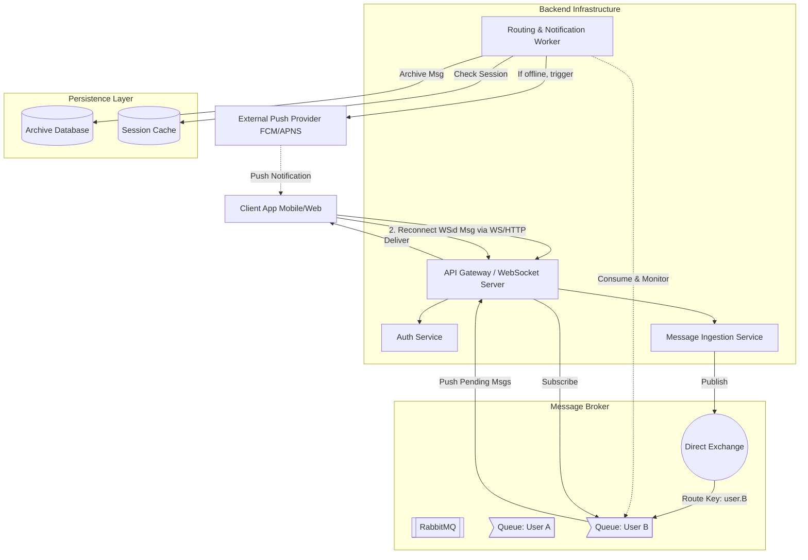
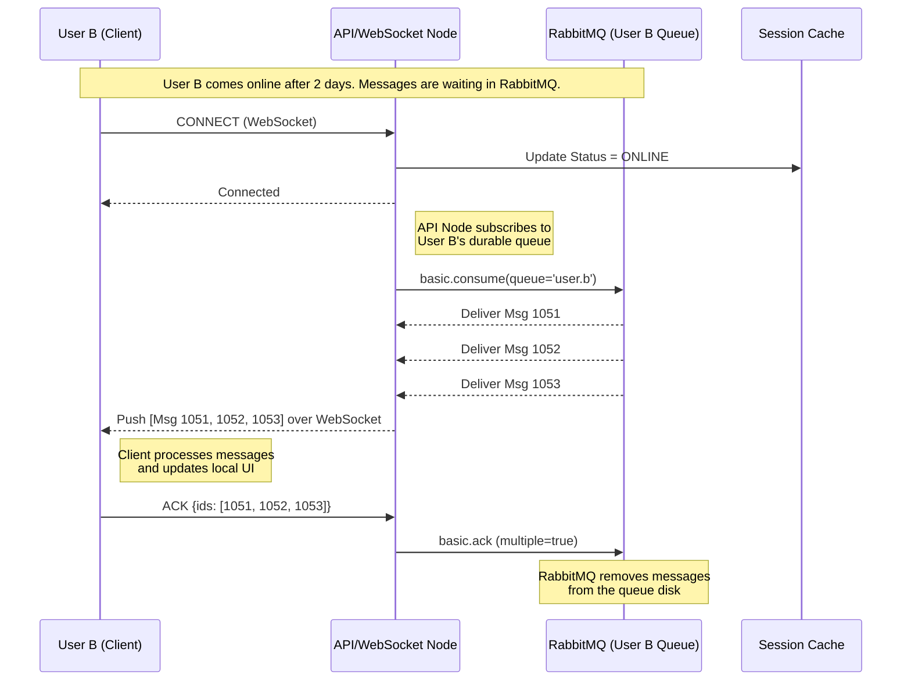
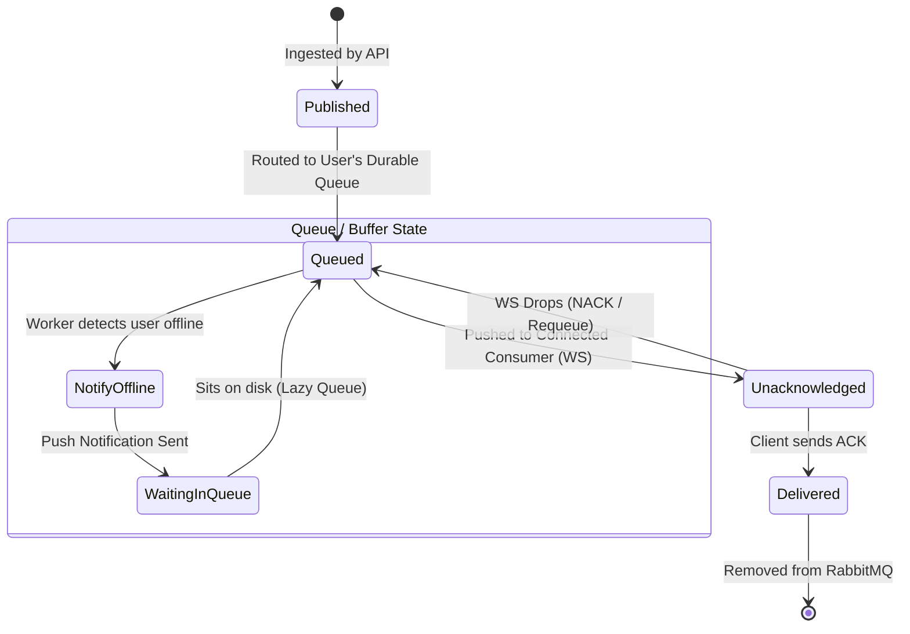

# 🧪 Laboratory Work 1: Variant 3 — Offline Message Delivery

## 🧠 System Concept

To handle users who might be offline for days or weeks, we rely on a robust message broker. By utilizing RabbitMQ with Durable Exchanges and Lazy Queues, we can safely buffer messages on disk without exhausting system memory. The database transitions to a secondary role as a historical archive, while RabbitMQ handles the active delivery state.

---

## 🧱 Part 1 — Component Diagram

### Design Decisions

1. Message Broker (RabbitMQ): Acts as the central nervous system. Each user has a dedicated durable queue. Messages sit safely on disk in RabbitMQ until explicitly acknowledged by the client.

2. Delivery/Routing Worker: A backend service that processes incoming messages, routes them to the correct RabbitMQ queue, and triggers push notifications if the user's WebSocket connection is absent.

3. Archive DB: The database is no longer the "Inbox." It simply acts as a cold-storage archive for chat history, written to asynchronously.

---

## 🔁 Part 2 — Sequence Diagram

### Scenario: User Comeback (Synchronization)

This scenario details the moment User B comes back online. Instead of the server querying a database, the WebSocket server simply binds to User B's RabbitMQ queue. RabbitMQ automatically pushes the buffered messages, and the system waits for the client to confirm receipt before deleting them.

---

## 🔄 Part 3 — State Diagram

### Object: `MessageDeliveryLifecycle`

With RabbitMQ, the state is primarily managed by the queue itself (Message sits in queue vs. Message is acknowledged).

---

## 📚 Part 4 — ADR (Architecture Decision Record)

### ADR-001: Message Broker Strategy for Offline Bufferin

## Status

Accepted

## Context

In "Variant 3: Offline Message Delivery," users may be offline for extended periods (weeks). We need a reliable mechanism to buffer these messages. Previously, database polling (the Inbox pattern) was considered to avoid overloading memory with millions of idle queues. However, database polling introduces high read latency, database locking issues, and complex cursor-management logic on the client.

## Decision

We will use RabbitMQ with Durable, Lazy Queues as the primary buffer and delivery mechanism.

Every user is assigned a specific routing key and a dedicated Durable Queue in RabbitMQ.

Queues are configured as Lazy Queues (queue.declare with x-queue-mode=lazy). This forces RabbitMQ to write messages immediately to disk rather than keeping them in RAM, perfectly suiting users who are offline for weeks.

We rely on RabbitMQ Consumer Acknowledgements (ACKs). Messages are not removed from the queue until the client explicitly confirms receipt.

The database is strictly used for asynchronous archiving, not active delivery.

## Alternatives

Database-First Buffering (Inbox Pattern): Rejected. High IOPS during "thundering herd" reconnections. Requires complex pagination and cursor state management.

In-Memory Redis Lists: Rejected. High risk of data loss on server restart and prohibitively expensive RAM usage for long-term offline buffering.

## Consequences

Reliability: Messages are safely persisted to disk via RabbitMQ. If a WebSocket connection drops mid-delivery, the un-ACKed messages are safely requeued.

Simplicity: The backend logic is heavily simplified. The server no longer tracks "what the user missed"; it simply subscribes to the queue, and RabbitMQ handles the cursor and delivery state.

Infrastructure Overhead: We must manage and monitor a RabbitMQ cluster, ensuring disk space is sufficient for the lazy queues and that connection limits are tuned for many idle queues.
