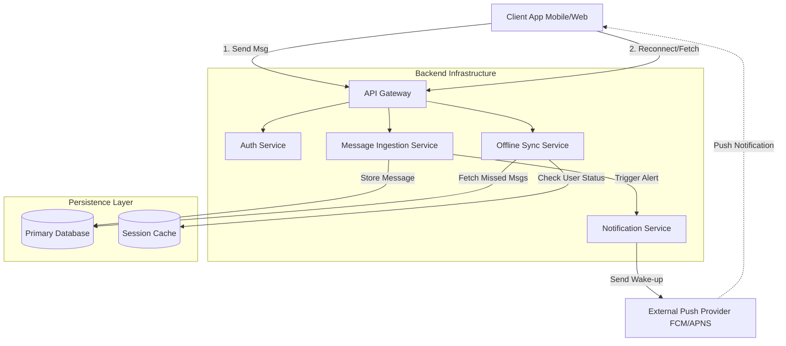
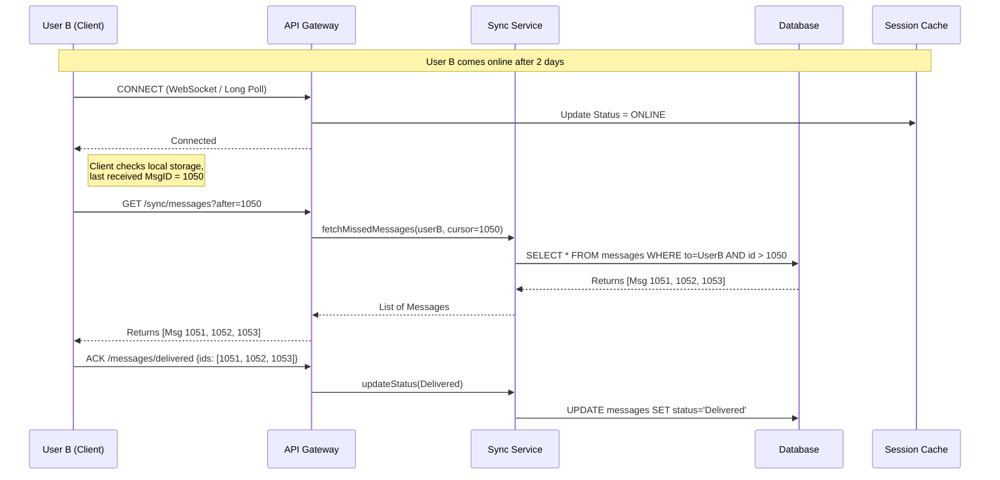
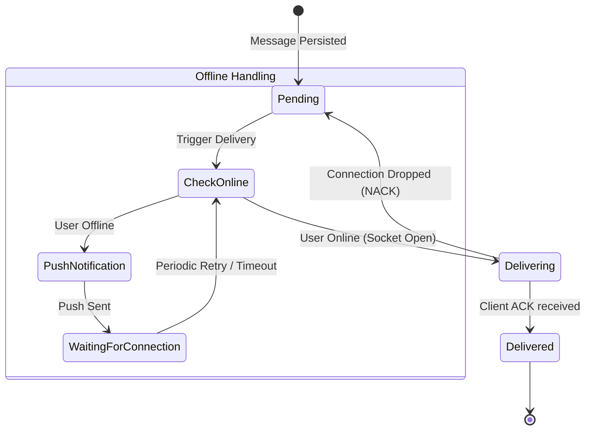

# 🧪 Laboratory Work 1: Variant 3 — Offline Message Delivery

## 🧠 System Concept

We cannot rely solely on in-memory queues because a user might be offline for days or weeks. If a queue server restarts or overflows, those messages would be lost. Therefore, the architecture prioritizes **persistent storage (the "Inbox" pattern)** over ephemeral message queues for long-term buffering.

---

## 🧱 Part 1 — Component Diagram

### Design Decisions

1. **Persistent Inbox (DB):** We treat the database as the source of truth. Messages are stored permanently immediately upon receipt.
2. **Push Notification Service:** Since the user is offline, we cannot send the data directly via WebSocket. We must use an external push service (like FCM/APNS) to notify the user to open the app.
3. **Sync Service:** A dedicated component to handle the logic of "What did I miss?" when a user finally reconnects.

---

## 🔁 Part 2 — Sequence Diagram

### Scenario: User Comeback (Synchronization)

This scenario details the critical moment when **User B comes back online** after being offline. The system must efficiently deliver all missed messages without overwhelming the client.

**Mechanism:** We use a **Cursor-based sync**. The client sends the ID of the last message it received. The server returns everything after that ID.

---

## 🔄 Part 3 — State Diagram

### Object: `DeliveryProcess`

This focuses on the lifecycle of the **delivery attempt** specifically for Variant 3. Unlike a standard lifecycle, this handles the "Unreachable" loop.

---

## 📚 Part 4 — ADR (Architecture Decision Record)

### ADR-001: Hybrid Storage Strategy for Offline Buffering

## Status

Accepted

## Context

In "Variant 3: Offline Message Delivery," users may be offline for extended periods (weeks).
We need to decide where to store messages waiting for delivery.
Standard Message Queues (RabbitMQ/Kafka) are excellent for high throughput but risky for long-term storage (retention limits, memory costs, lack of queryability for specific users).

## Decision

We will use **Database-First Buffering (The "Inbox" Pattern)** combined with **Cursor-Based Sync**.

1. All messages are immediately committed to the primary database (PostgreSQL/Cassandra) upon receipt.
2. No separate "delivery queue" holds the message payload.
3. Delivery logic effectively queries the database: `SELECT * FROM messages WHERE recipient_id = X AND status = 'pending'`.

## Alternatives

* **In-Memory Queues (e.g., Redis Lists):** Rejected. If Redis crashes or fills up during a recipient's 2-week vacation, messages are lost.
* **Durable Message Brokers (e.g., RabbitMQ Durable Queues):** Considered, but rejected. Managing millions of unique queues (one per user) is operationally complex and resource-heavy for long-term dormant users.

## Consequences

* **Reliability:** Zero data loss if the delivery service crashes; data is safely on disk.
* **Simplicity:** The client logic is simple ("Give me everything since ID X").

* **Database Load:** High IOPS on the database during "thundering herd" scenarios (e.g., everyone comes online at once). We will mitigate this with caching and pagination.
